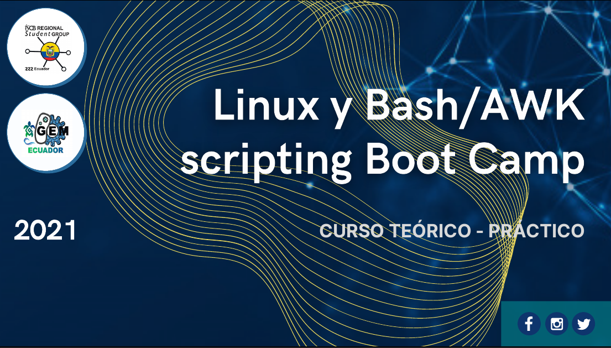

# Inicio
El equipo de [iGEM Ecuador](https://www.facebook.com/iGEMECUADOR) en colaboración con el Grupo de Estudiantes de Biología Computacional del Ecuador, [RSG Ecuador](https://rsg-ecuador.iscbsc.org/), hemos elaborado el taller teórico-práctico:

    
**Autores:** Juan Zurita, [Sebastián Ayala](https://asar1245.github.io/Sebastian-AyalaRuano/)

## Descripción y objetivo del Boot Camp

Este Boot Camp tiene como objetivo aprender sobre sistemas operativos basados en UNIX (con énfasis en GNU/Linux), manejo de Terminal, procesamiento de archivos y AWK/Bash con enfoque en Bioinformática. El taller se realizará de forma virtual y tendrá una combinación de clases sincrónicas y asincrónicas, con un componente práctico para aplicar todos los conocimientos adquiridos. 

## Contenidos
1. [Introducción a Unix y GNU/Linux](https://rsg-ecuador.github.io/unix.bioinfo.rsgecuador/content/Curso_basico/01_Unix_GNU-Linux/0_Resumen.html)
2. [Jupyter Lab](https://rsg-ecuador.github.io/unix.bioinfo.rsgecuador/content/Curso_basico/02_JupyterLab/0_Resumen.html)
3. [Manejo terminal](https://rsg-ecuador.github.io/unix.bioinfo.rsgecuador/content/Curso_basico/03_Manejo_terminal/0_Resumen.html)
4. [Procesamiento de ficheros, regex y pipes](https://rsg-ecuador.github.io/unix.bioinfo.rsgecuador/content/Curso_basico/04_Procesamiento_ficheros_regex_pipes/0_Resumen.html)
5. [Ejercicios de procesamiento ficheros con enfoque en Bioinformática](https://rsg-ecuador.github.io/unix.bioinfo.rsgecuador/content/Curso_basico/05_Ejercicios_procesamiento_ficheros_Bioinfo/0_Resumen.html)
6. [Comando Make para instalar programas](https://rsg-ecuador.github.io/unix.bioinfo.rsgecuador/content/Curso_basico/06_Make/0_Resumen.html)
7. [SAM Tools: conjunto de programas útiles en Bioinformática](https://rsg-ecuador.github.io/unix.bioinfo.rsgecuador/content/Curso_basico/07_SAM_Tools/0_Resumen.html)
8. [AWK: lenguaje de programación para procesamiento de archivos de texto](https://rsg-ecuador.github.io/unix.bioinfo.rsgecuador/content/Curso_avanzado/01_AWK/0_Resumen.html)
9. [Bash como lenguaje de programación](https://rsg-ecuador.github.io/unix.bioinfo.rsgecuador/content/Curso_avanzado/02_Bash/0_Resumen.html)
10. [Git y GitHub](https://rsg-ecuador.github.io/unix.bioinfo.rsgecuador/content/Curso_avanzado/03_Git_GitHub/0_Resumen.html)

El curso básico comenzará el 26 de Abril y terminará el 9 de Mayo. Se tendrán clases pregrabadas enviadas por Google Classrom, foros de discusión de los temas del curso, y clases presenciales los Sábados en dos horarios elegibles: 9:00-12:00 y 15:00-18:00 (GMT-5). El material escrito lo iremos subiendo semanalmente a este repositorio. 

## Audiencia y requerimientos
El curso está orientado a estudiantes de grado y posgrado e investigadores que quieran aprender sobre GNU/Linux, manejo de terminal, y AWK/Bash con enfoque en Bioinformática. Para el curso básico no se necesita tener acceso a una terminal de Bash, es parte del contenido del curso; mientras que para el curso avanzado asumimos que los estudiantes ya tienen acceso a un emulador de terminal de Bash por alguno de los métodos disponibles (máquina virtual, subsistema de Windows 10 para Linux, Dual boot, etc). 

## Material de referencia
El contenido de  este curso se realizó en base al [material de un grupo de estudio](https://github.com/RSG-Ecuador/Grupo-De-Estudio-Linux-Bash) realizado por el RSG Ecuador, y al libro de acceso libre [The Unix Workbench](https://leanpub.com/unix) de Sean Kross. La literatura adicional se especifica en cada tema de forma pertinente. 

